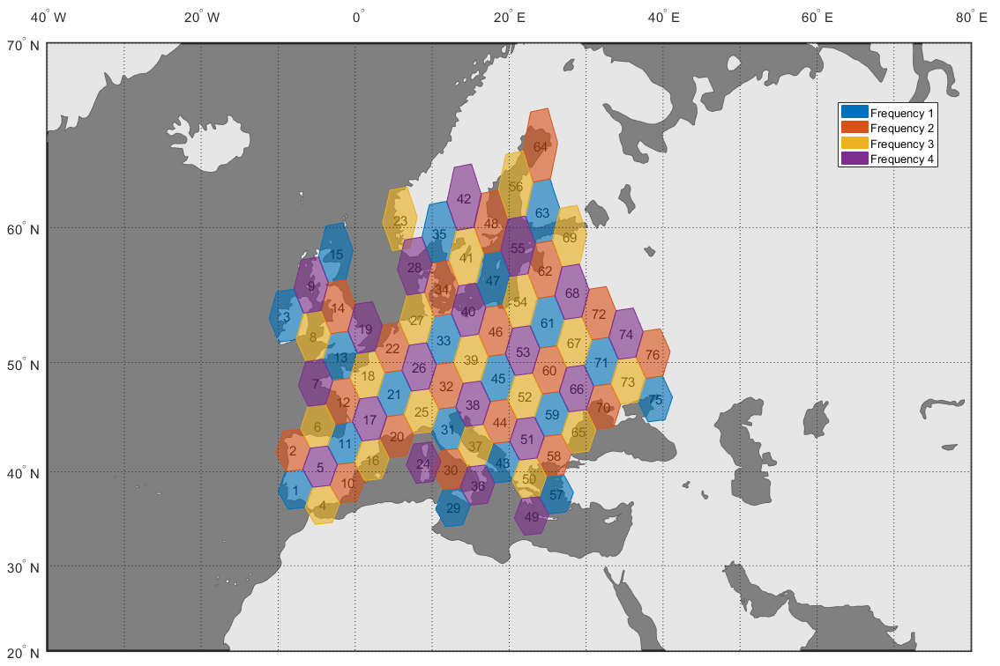
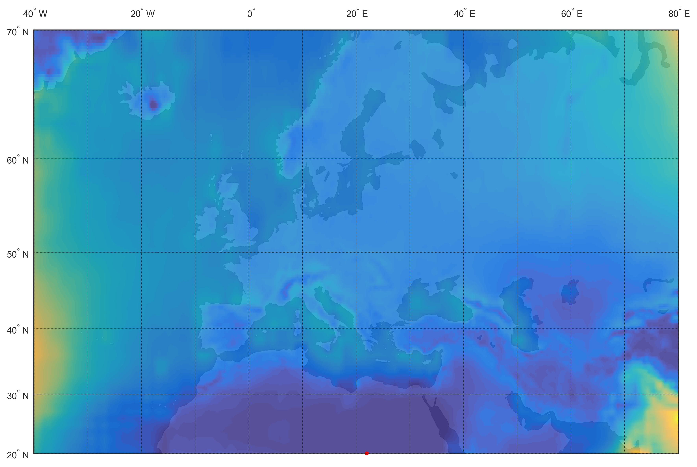

# Multibeam Fixed-Satellite Service Simulator

Graphical simulator in [MATLAB®](http://www.mathworks.com/products/matlab/) that aims to assist in the design of a multibeam satellite communications system to provide broadband fixed-satellite service in Europe.

## Functions
**mfs3** can generate relevant graphical presentations of system parameters on a map of a defined geographical region of interest.

|  |  |
|:----------------------------------:|:---------------------------------------:|
| Frequency/polarization reuse plan. | Attenuation due to rainfall in Ka band. |

Different maps related to the architecture and frequency plan of the communications system can be produced, including the following:
- Coverage region and user beam center locations.
- Gateway ground station locations.
- Allocation of user beams to gateway stations.
- Frequency/polarization reuse plan across user beams.

The simulator can also perform link budget calculations on a large coordinate grid. Maps can be generated for different magnitudes involved in the budget, such as:
- Attenuation (due to free-space path loss, rainfall, clouds/fog and atmospheric gases).
- Co-channel interference levels in user beams.
- Carrier to noise (C/N), interference (C/I) and intermodulation (C/IM) ratios.

## Examples
Some [example scripts](examples) are provided that demonstrate the different functions supported by the simulator.

## About
This software was developed as part of a course in Satellite Communications at the [Polytechnic University of Madrid](http://www.upm.es), for a project titled “**Design of a multibeam satellite for Europe (FSS):** Comparison of performance with Ka vs Q/V feeder links”.

The objective was to compare the impact of using Ka band or Q/V band feeder links in the throughput, transponder achitecture and ground segment of a multibeam fixed-satellite service. A graphical simulator was to be developed to assist in the preliminary design of the system in both scenarios.

### Credits
The following people contributed to the original project:
- Javier de Pablo
- Juan Ignacio Gaya
- María Lozano
- Beatriz Martínez
- Alberto Sanz

## License
mfs3 is open-sourced software licensed under the [MIT License](http://opensource.org/licenses/MIT). For the full copyright and license information, please view the [LICENSE](LICENSE) file that is distributed with this source code.

This software package contains source code and data provided by the [ITU-R Radiowave Propagation Study Group (SG 3)](http://www.itu.int/en/ITU-R/study-groups/rsg3/Pages/iono-tropo-spheric.aspx).
