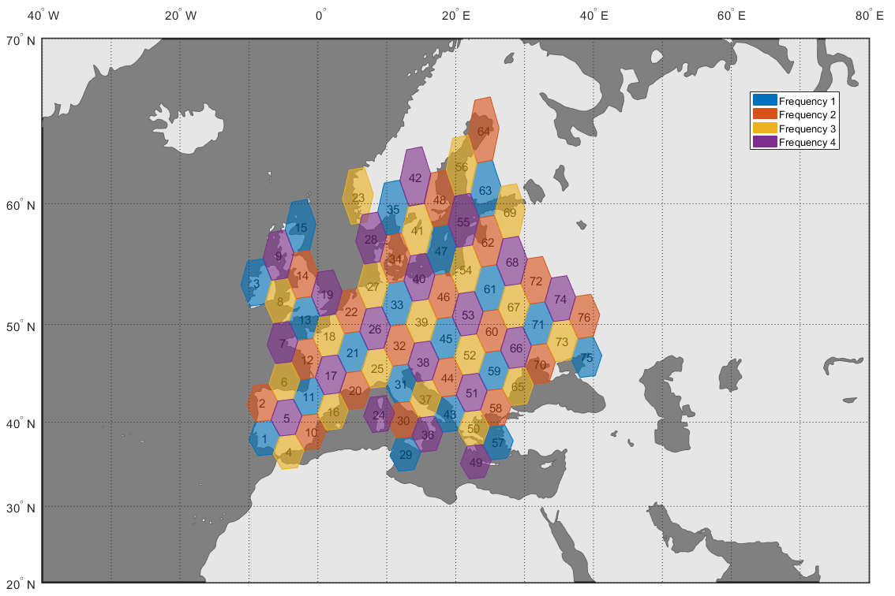
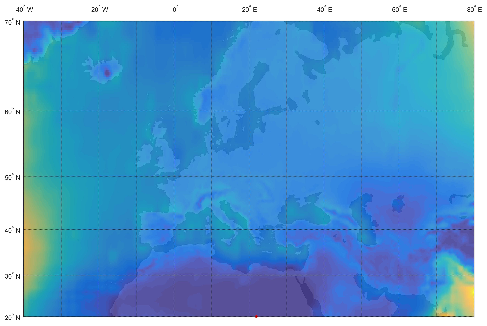

# Multibeam Fixed-Satellite Service Simulator

Graphical simulator in [MATLAB®](http://www.mathworks.com/products/matlab/) that aims to assist in the design (ground segment architecture, frequency reuse plan, link budget calculations, ...) of a fixed-satellite service with multibeam coverage over Europe.

|  |  |
|:-------------------------------------------------:|:---------------------------------------------------:|
| Frequency reuse plan.                             | Attenuation due to rainfall.                        |

## About
This software was developed as part of a course in Satellite Communications at the [Polytechnic University of Madrid](http://www.upm.es), for a project titled “**Design of a multibeam satellite for Europe (FSS):** Comparison of performance with Ka vs Q/V feeder links”.

The objective was to compare the impact of using Ka band or Q/V band feeder links in the throughput, transponder achitecture and ground segment of a multibeam fixed-satellite service. A graphical simulator was to be developed to assist in the preliminary design of the system in both scenarios.

### Credits
The following people contributed to the original project:
- Javier de Pablo
- Juan Ignacio Gaya
- María Lozano
- Beatriz Martínez
- Alberto Sanz

## License
mfs3 is open-sourced software licensed under the [MIT License](http://opensource.org/licenses/MIT). For the full copyright and license information, please view the [LICENSE](LICENSE) file that is distributed with this source code.

This software package contains source code and data provided by the [ITU-R Radiowave Propagation Study Group (SG 3)](http://www.itu.int/en/ITU-R/study-groups/rsg3/Pages/iono-tropo-spheric.aspx).
